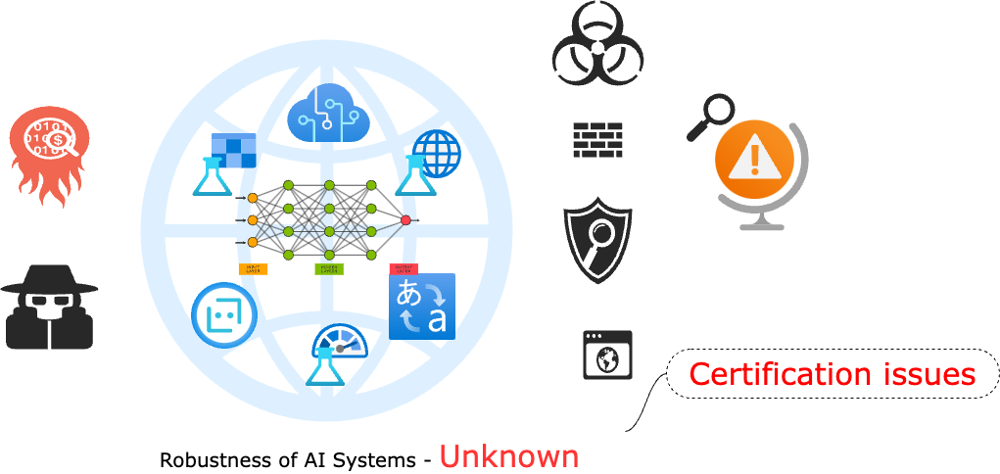
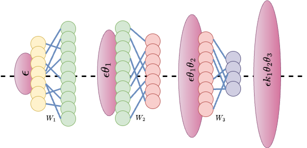
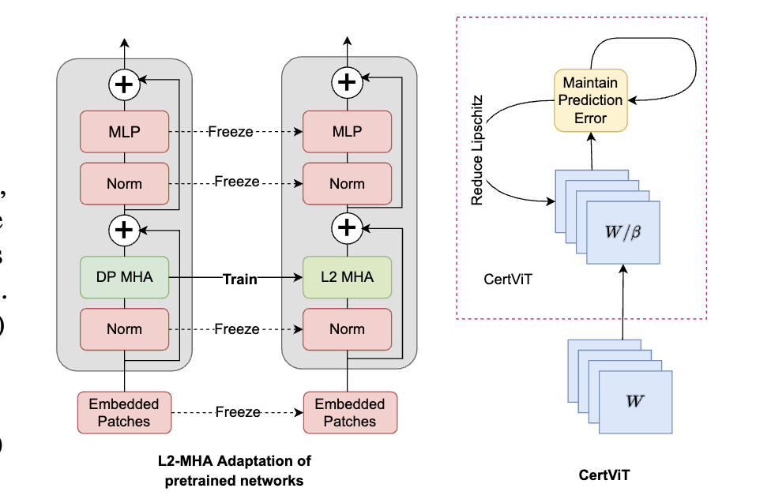

<!-- For now, this page is assumed to be a static description of your courses. You can convert it to a collection similar to `_projects/` so that you can have a dedicated page for each course.

Organize your courses by years, topics, or universities, however you like! -->

### Robustness and AI Safety

 Neural networks are being extensively used and deployed in a wide range of applications, including safety- and mission-critical tasks. Certified robustness of neural networks against perturbations caused by faults or maliciously inserted data is an important research topic in the machine learning community and a strict requirement from an industrial perspective. I develop methods and scalable tools that promote robustness of neural networks with concentration on real-world applications.

### Formal guarantees on robustness

 Heuristic approaches only provide empirical robustness. Such defenses are prone to blind spots and gives superficial sense of robustness which can be easily broken with stronger and better crafted attacks. Instead, I concentrate on providing formal guarantees and defenses using Lipschitz bounds which provides guaranteed bounds on the output of the network w.r.t to the input perturbations. Such methods are attack independent and provide stronger notion of robustness necessary for safety critical applications.

### Robustness of large Vision and language models

 With the new wave of Large Vision and language models, it is imperative to understand their robustness and trustworthiness. Such models are far from certified and cannot make their way to being deployed in real-time and safety-critical applications. Understanding these models and providing tools and methods to quantify/evaluate and promote their robustness is essential. Although with my latest work CertViT we could reduce the Lipschitz bounds to some extent, the values remain large and hence cannot be certified. Thereby giving more proof of the necessity and need of studying certification of robustness for large models in more depth. 

